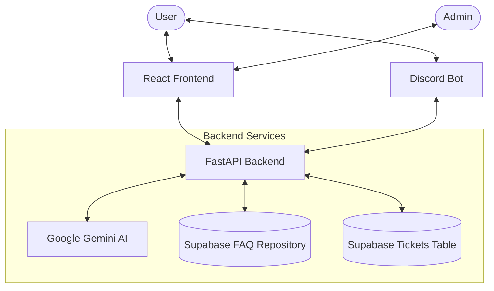
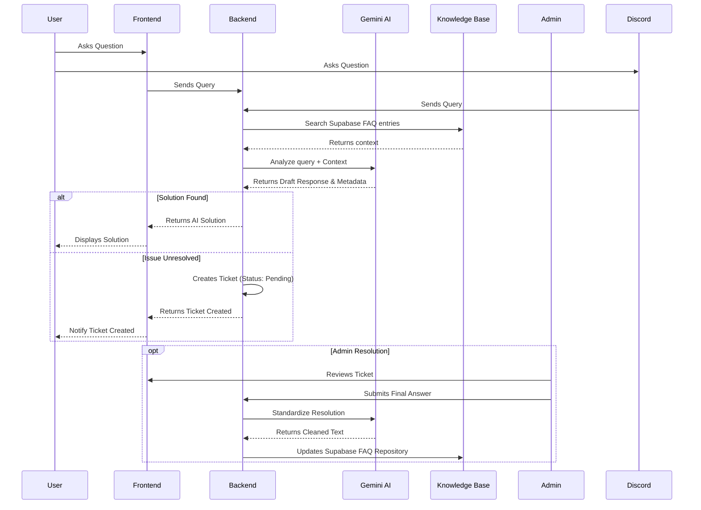

# Project LoopBack
`LoopBack` is an AI-powered IT Support Helpdesk system that acts as a first line of defense for support teams. It intelligently handles user inquiries using a Supabase-backed Knowledge Base (KB) and escalates complex issues to human agents when necessary. Crucially, it learns from every resolved ticket to improve its future responses.

## Key Features

*   **Intelligent Chat Interface**: Users converse naturally with the AI to troubleshoot issues.
*   **Automatic Escalation**: If the AI cannot resolve an issue (or if hardware/admin intervention is required), it automatically drafts a ticket with a summary of the problem and the full conversation history.
*   **Knowledge Base Integration**:
    *   **Retrieval**: Uses Supabase FAQ entries as the live knowledge base.
    *   **Robust Search**: Matches against category, issue, question, and tags using keyword overlap.
    *   **Duplicate Prevention**: Automatically blocks duplicate or highly similar questions from being added to the KB to keep it clean.
*   **Self-Learning**: When an admin marks a ticket as "Resolved" with a quality answer, the system automatically adds that solution to the Knowledge Base for future use.
*   **Admin Dashboard**: View and manage tickets, see AI-drafted solutions, and monitor KB updates.
*   **Database Viewer**: The Database button opens a live Supabase FAQ view with a small sample of entries.
*   **Multi-Channel Support**:
    *   **Discord Bot**: Users can open tickets directly from Discord. The bot creates dedicated **threads** for each issue to keep channels clean.

## Technology Stack

*   **Backend**: Python (FastAPI)
*   **Frontend**: React (Vite + Tailwind CSS + Lucide Icons)
*   **AI Model**: Google Gemini-3-Pro
*   **Database**: Supabase Postgres for tickets and FAQ knowledge-base entries.
*   **Integration**: Discord.py (Bot)

## System Architecture


```mermaid
graph TD
    User([User]) <--> Frontend[React Frontend]
    User([User]) <--> Discord[Discord Bot]
    Frontend <--> API[FastAPI Backend]
    Discord <--> API
    
    subgraph Backend Services
        API <--> AI[Google Gemini AI]
        API <--> KB[(Supabase FAQ Repository)]
        API <--> DB[(Supabase Tickets Table)]
    end
    
    Admin([Admin]) <--> Frontend
```

## Workflow


```mermaid
sequenceDiagram
    participant U as User
    participant F as Frontend
    participant B as Backend
    participant AI as Gemini AI
    participant K as Knowledge Base
    participant A as Admin

    U->>F: Asks Question
    U->>Discord: Asks Question
    F->>B: Sends Query
    Discord ->> B: Sends Query
    B->>K: Search Supabase FAQ entries
    K-->>B: Returns context
    B->>AI: Analyze query + Context
    AI-->>B: Returns Draft Response & Metadata
    
    alt Solution Found
        B-->>F: Returns AI Solution
        F-->>U: Displays Solution
    else Issue Unresolved
        B->>B: Creates Ticket (Status: Pending)
        B-->>F: Returns Ticket Created
        F-->>U: Notify Ticket Created
    end
    
    opt Admin Resolution
        A->>F: Reviews Ticket
        A->>B: Submits Final Answer
        B->>AI: Standardize Resolution
        AI-->>B: Returns Cleaned Text
        B->>K: Updates Supabase FAQ Repository
    end
```

## Setup Instructions

### Prerequisites
*   Python 3.9+
*   Node.js & npm
*   Google Gemini API Key
*   Supabase project with API URL and service role key

### Backend Setup
1.  Navigate to the project root:
    ```bash
    cd LoopBack
    ```
2.  Install dependencies:
    ```bash
    pip install -r requirements.txt
    ```
3.  Set up your environment variables:
    *   Create a `.env` file in the root directory.
    *   `GOOGLE_API_KEY=your_api_key_here`
    *   `USE_SUPABASE=true`
    *   `SUPABASE_URL=your_supabase_project_url`
    *   `SUPABASE_SERVICE_ROLE_KEY=your_service_role_key`
    *   `DISCORD_BOT_TOKEN=<bot-token>`
    *   `DISCORD_GUILD_ID=<server-id>` (The server ID where you want the bot to operate)
    *   `DISCORD_CHANNEL_ID=<channel-id>` (The channel ID where you want the bot to operate)

    *   If you wish to use Langsmith services, add 
    `LANGSMITH_TRACING=true`
    `LANGSMITH_ENDPOINT=https://api.smith.langchain.com`
    `LANGSMITH_API_KEY=<your-api-key>`
    `LANGSMITH_PROJECT=<your-project-name>`
    *   Else, simply add the line `LANGSMITH_TRACING=true`

4.  Start the backend server:
    ```bash
    python3 server.py
    ```
    The server will run on `http://localhost:8000`.

### Frontend Setup
1.  Navigate to the frontend directory:
    ```bash
    cd frontend
    ```
2.  Install dependencies:
    ```bash
    npm install
    ```
3.  Start the development server:
    ```bash
    npm run dev
    ```
    The application will be available at `http://localhost:5173`.
4.  Run the discord bot
    ```bash
    python3 discord_bot.py
    ```
5.  Migrate the old local JSON/CSV data into Supabase:
    ```bash
    python scripts/migrate_local_to_supabase.py
    ```

## Usage

1.  **User Question**: Users open the app and type their IT issue. The AI attempts to solve it using the Supabase Knowledge Base.
2.  **Ticket Creation**: If unresolved, a ticket is created.
3.  **Admin Resolution**: An admin reviews the ticket via the dashboard (or simulates resolution via API) and provides a final answer.
4.  **Learning**: The system detects the high-quality resolution and adds it to the Supabase FAQ repository for next time.

## Project Structure

*   `server.py`: Main backend logic (App, API endpoints, AI integration).
*   `discord_bot.py`: Discord bot logic.
*   `db/`: Supabase client and repository layer.
*   `scripts/migrate_local_to_supabase.py`: One-time migration script for local data.
*   `tickets_db.json`: Legacy snapshot only.
*   `knowledge_base/`: Legacy CSV snapshot only.
*   `frontend/`: React source code.
    *   `src/App.jsx`: Admin dashboard and ticket queue.
    *   `src/UserPortal.jsx`: User portal component kept for reference.
